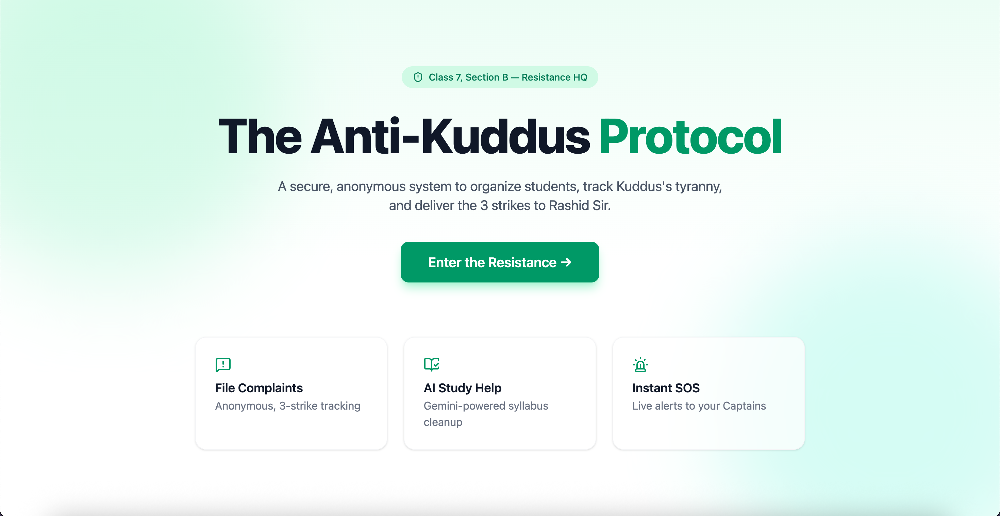
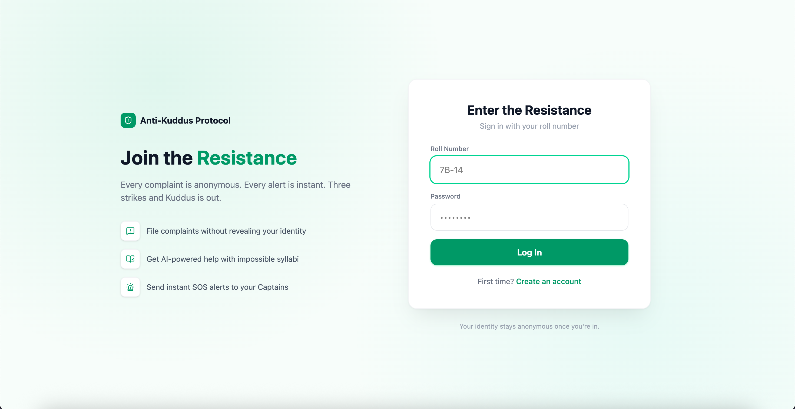
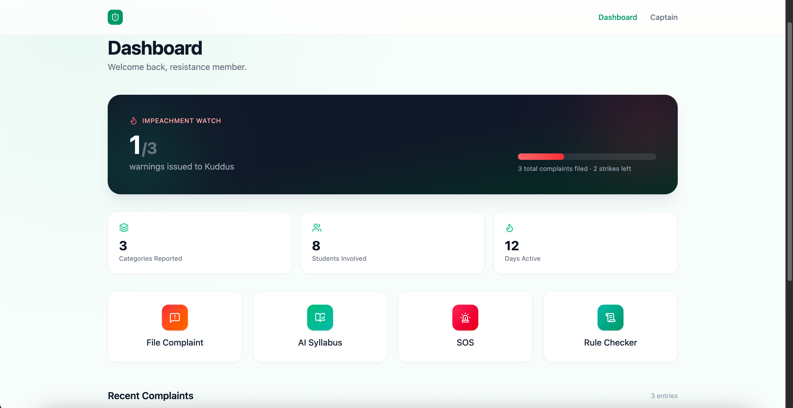
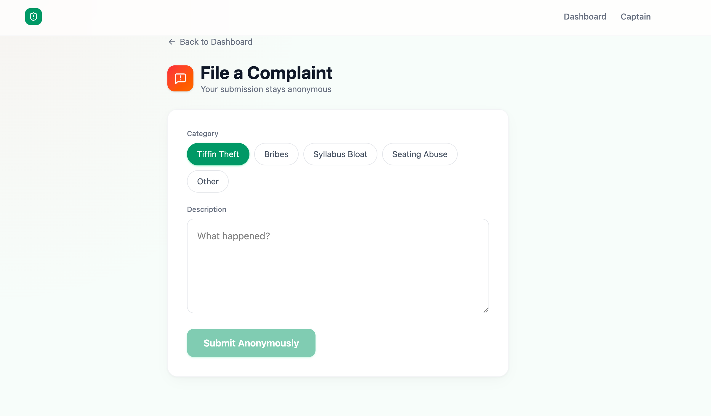
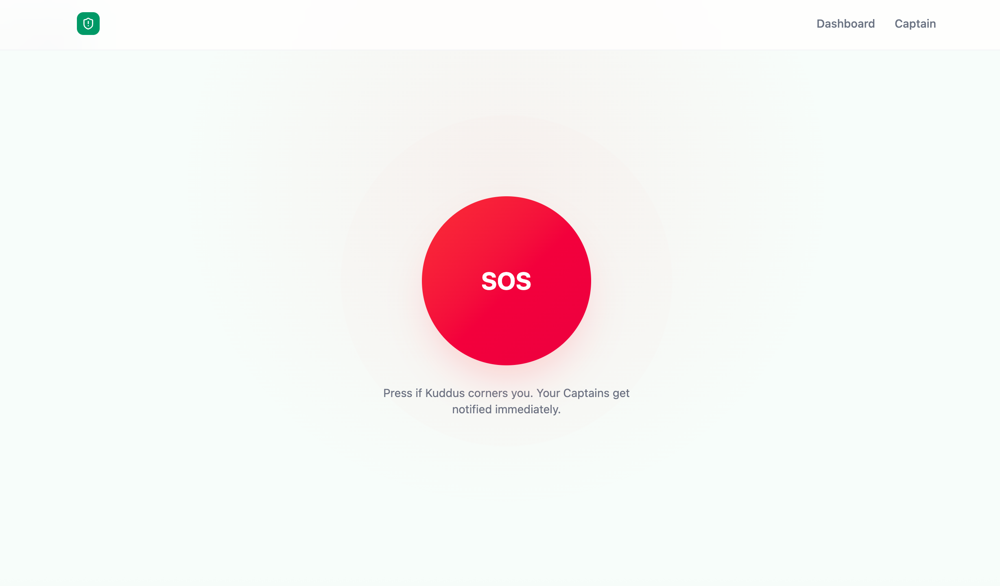
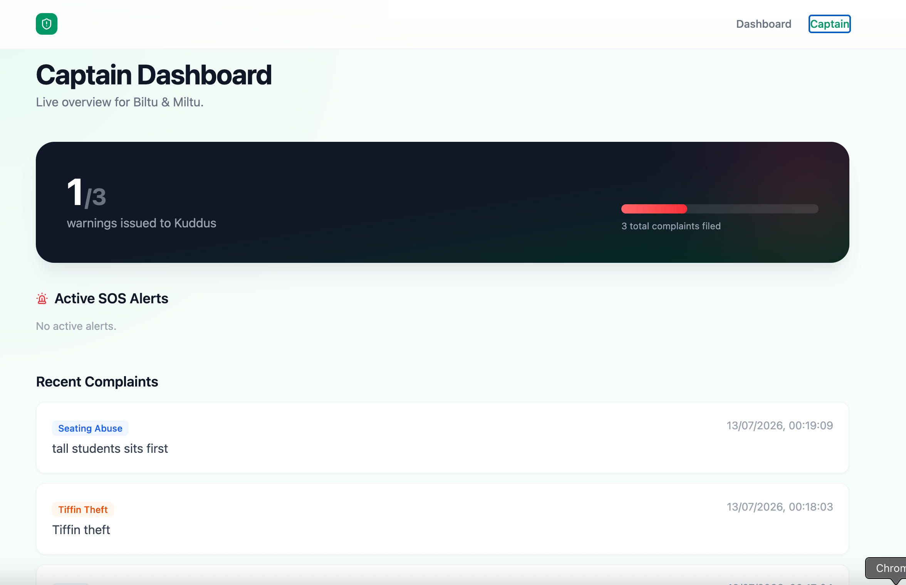

# The Anti-Kuddus Protocol

A secure, anonymous system built for the BAIUST CSE Spring Fest 2026 Hackathon — organizing students, tracking a rogue Class Captain's tyranny, and delivering the 3 strikes needed for impeachment.

## Live Demo
[Add your deployed link here once hosted]

## Problem Statement
Full brief: *The Fall of Kodu Kuddus* (BAIUST Computer Club, 10th Panel)

## Features
- **Anonymous Complaint Portal** — Roll-number login, category-based complaints, live 3-strike warning tracker
- **AI Syllabus Summarizer** — Gemini-powered cleanup of bloated syllabi into topics, summaries, and study checklists
- **Instant SOS System** — One-tap emergency alert with location, live-broadcast to Captain Dashboard
- **Kuddus Fact-Checker** — Keyword-matching rule verification against the official rulebook
- **Captain Dashboard** — Real-time view of warnings, SOS alerts, and complaint feed

## Tech Stack
- React (Vite)
- Tailwind CSS
- Firebase Authentication (Email/Password, roll-number based)
- Firebase Firestore (real-time listeners)
- Google Gemini API
- Lucide React (icons)
- React Router

## Architecture
src/
├── components/     # Reusable UI (Navbar, Button, Card)
├── pages/          # Route-level screens
├── services/       # Firebase + Gemini API calls
├── firebase/       # Firebase SDK initialization
├── hooks/          # Custom hooks (useWarnings, useRecentComplaints, useSOSFeed)
├── contexts/       # Auth state (AuthContext)
└── utils/          # Helpers (roll number → email mapping)

### Firestore Collections
- `users` — `{ rollNumber, role, createdAt }`
- `complaints` — `{ submittedBy, category, description, createdAt }`
- `sos_alerts` — `{ raisedBy, location, status, timestamp }`
- `meta/kuddusStatus` — `{ totalComplaints, warnings }`
- `rules` — `{ keyword[], ruleText }`

## Setup & Installation

1. Clone the repo:
```bash
   git clone https://github.com/Imranoid/anti-kuddus-protocol.git
   cd anti-kuddus-protocol
```

2. Install dependencies:
```bash
   npm install
```

3. Create a `.env` file in the project root with your own Firebase + Gemini credentials:

VITE_FIREBASE_API_KEY=your_key
VITE_FIREBASE_AUTH_DOMAIN=your_project.firebaseapp.com
VITE_FIREBASE_PROJECT_ID=your_project_id
VITE_FIREBASE_STORAGE_BUCKET=your_project.appspot.com
VITE_FIREBASE_MESSAGING_SENDER_ID=your_sender_id
VITE_FIREBASE_APP_ID=your_app_id
VITE_GEMINI_API_KEY=your_gemini_key

4. Run the dev server:
```bash
   npm run dev
```
## Screenshots








## Team
[Your names / roll numbers here]

## Future Improvements
- Cryptographic anonymity pipeline for complaints
- EXIF metadata stripping on photo evidence
- Line-of-sight seating optimization algorithm
- Semantic (embedding-based) rule fact-checking
- Real-time push notifications for SOS (vs. current Firestore listener approach)

## Team
[Your names / roll numbers here]

## Future Improvements
- Cryptographic anonymity pipeline for complaints
- EXIF metadata stripping on photo evidence
- Line-of-sight seating optimization algorithm
- Semantic (embedding-based) rule fact-checking
- Real-time push notifications for SOS (vs. current Firestore listener approach)